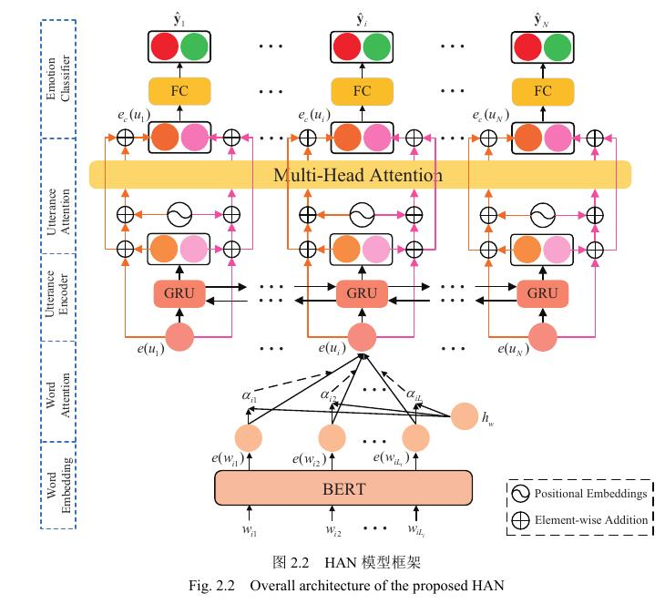

# HAN-ReGRU: Hierarchical attention network with residual gated recurrent unit for emotion recognition in conversation
This repository is the implement of our paper [HAN-ReGRU: Hierarchical attention network with residual gated recurrent unit for emotion recognition in conversation](https://link.springer.com/article/10.1007/s00521-020-05063-7).

## Model Architecture
<!--  -->
<div align="center">
    
</div>

## Setup
- Check the packages needed or simply run the command:
```console

pip install -r requirements.txt
```
- Download the IEMOCAP and MELD datasets from [AGHMN storage](https://drive.google.com/drive/folders/1RDhrVhTm8tDtbs5BhlEl1QGFPibd94Jo).
- For each dataset, we use ```Preprocess.py``` to preprocess it. You can downloaded the preprocessed datasets from [here](https://drive.google.com/drive/u/1/folders/1d0-rEYuF6W5iKiqjiBVaRD8groSM8iTa), and put them into `Data/`.

## Run HAN
- Run the model on IEMOCAP dataset:
```console

bash exec_iemocap.sh
```
- Run the model on MELD dataset:
```console

bash exec_meld.sh
```

## Acknowledgements
- Special thanks to the [AGHMN](https://github.com/wxjiao/AGHMN) for sharing the codes and datasets.
	
## Citation
If you find our work useful for your research, please kindly cite our paper as follows:
```
@article{ma2021han,
  title={HAN-ReGRU: hierarchical attention network with residual gated recurrent unit for emotion recognition in conversation},
  author={Ma, Hui and Wang, Jian and Qian, Lingfei and Lin, Hongfei},
  journal={Neural Computing and Applications},
  volume={33},
  pages={2685--2703},
  year={2021},
  publisher={Springer}
}
```